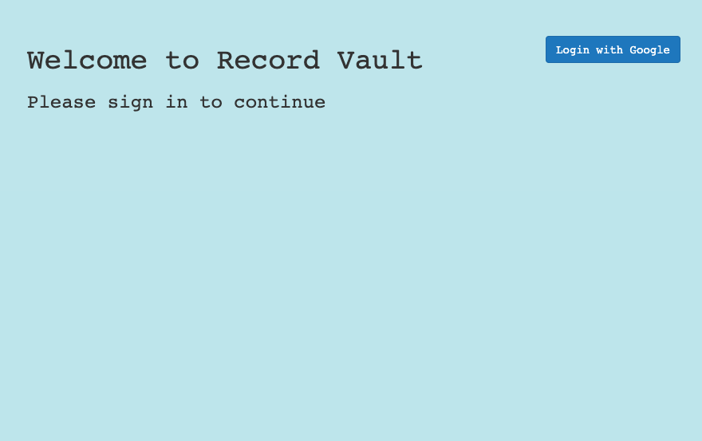
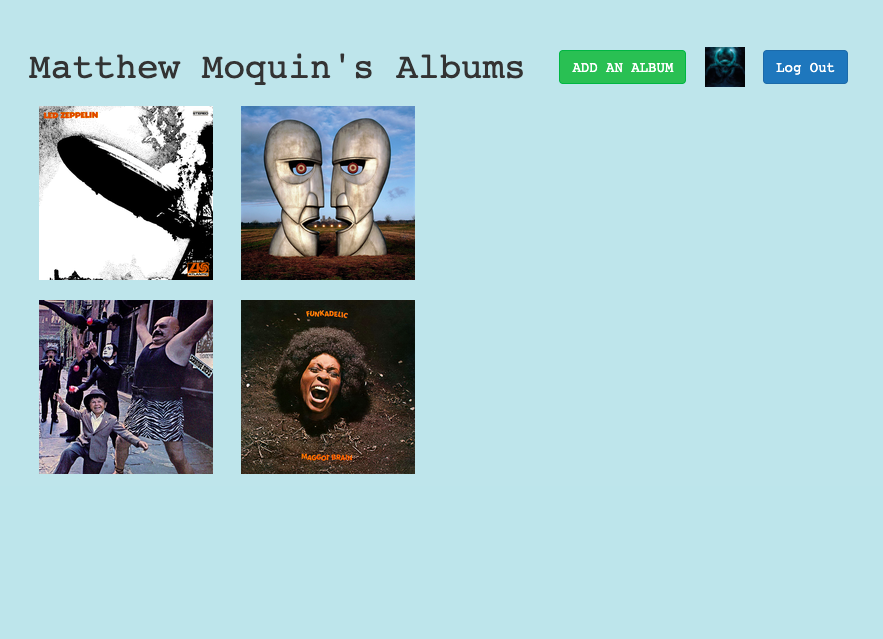
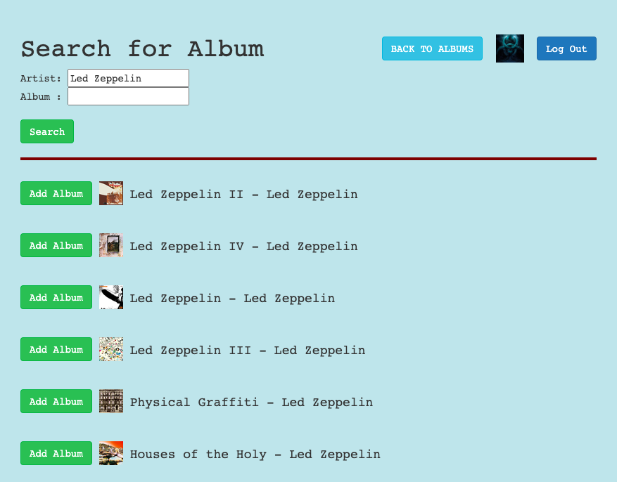
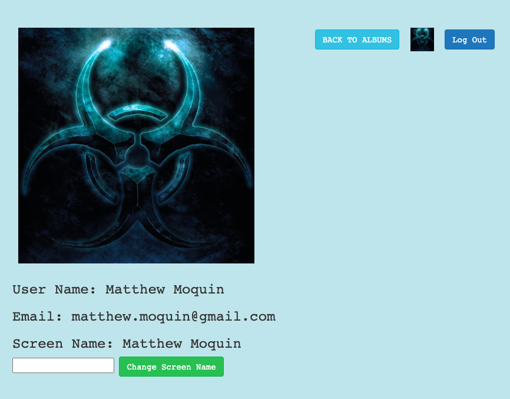

# Record-Vault
## Welcome to my Unit 2 project: [Record-Vault](https://mjm-record-vault.herokuapp.com/)

### Description:
This app will help you keep track of your vinyl/cd collection. It will allow you to search for and add your albmums from a vast database. Once an album is added it will automatically populate with the album cover, track listing and brief summary of the record.

### Application Navigation:
#### < Landing Page \>

#### < Home Page \>

#### < Search/Add Page \>

#### < Profile Page \>

### Technologies Used:

### Navigation Instructions:

( Start building your record vault [Here](https://mjm-record-vault.herokuapp.com/) )

When you first load the page, you will be brought to a landing page that will require you to login with Google. After logging in, you will see your current record collection (if this is your first visit, it will be empty). You can add an album by clicking on the 'Add Album' button on the top right. Once at the search page you can search for your favorite albums. After you've selected an album to add, you'll be redirected back to your home page which will show all of your album covers. You can view the details of any particular album by clicking on the album cover itself. The detail page is also where you would removed an album if the need arises. You can get to your profile page by clicking on the avatar between the album and logout buttons in the navigation bar. Here you will be presented with your google information and the also you can set/change your screen name.

### Future Features:

* Add ability to view other users' collections
* Fix duplicate album addition
* Have all users seeiing the same instance of an album
* Add user ability to select favorite tracks